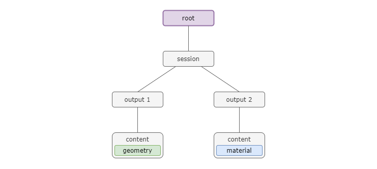
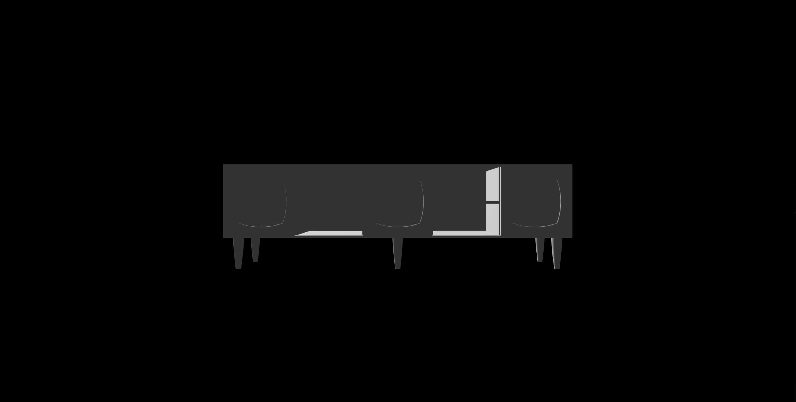
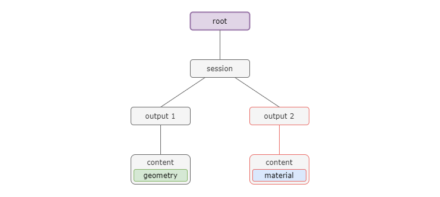
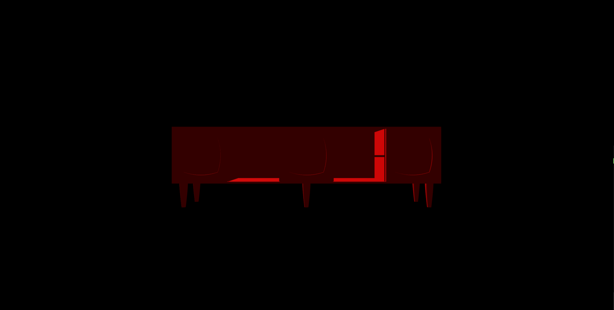
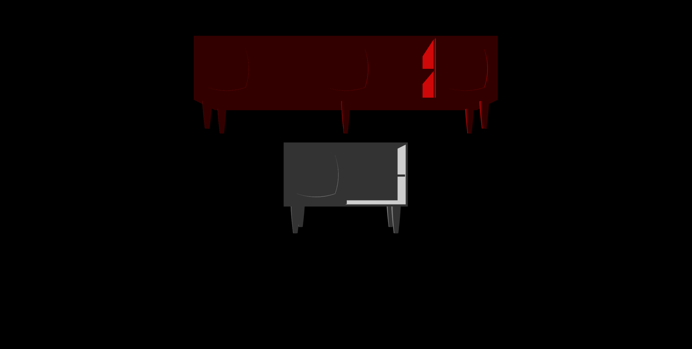
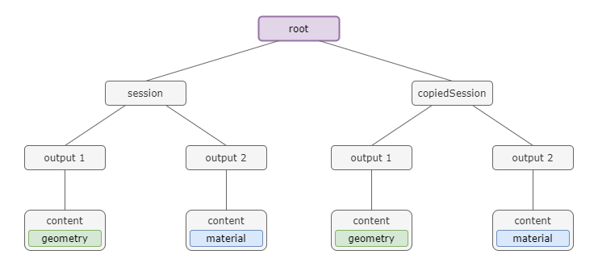
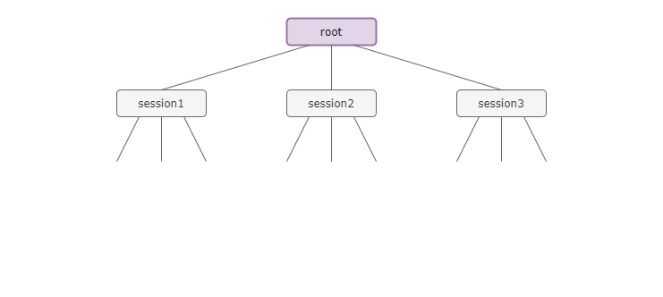

<script defer src="https://viewer.shapediver.com/v3/0.1.0/bundle.js"></script>


# Viewer API

## Simple Examples
<details>

### The first Session and Viewer
Let's look at an easy example to set up a session with a viewer.
This, and accessing the scene tree is the purpose of the main {@link Api}.

```typescript
import "reflect-metadata"
import { api, RENDERERTYPE } from "@shapediver/viewer"

// From the api let's create a session with a ticket and a modelview url
const session = await api.createSession({ ticket: 'MY_TICKET', modelViewUrl: 'MY_MODELVIEW_URL', id: 'mySession'});

// From the api let's also create a viewer on our canvas
const viewer = await api.createViewer({ canvas: CANVAS, id: 'myViewer' });
```

That's it, with that we have loaded a session and created a viewer on a canvas.

### Adjusting Parameters and requesting Exports

Adjusting parameters and requesting exports is basically just as easy. The {@link Session} part of our API is responsible for that. Let's assume we did the setup exactly as above and continue from there.
```typescript
// Get a parameter with a specific ID
// Note: It is also easily possible to get the parameter by name, type or any other desired criteria.
const parameter = session.getParameter('SOME_ID');

// To change the value of this parameter we can simply just change it (setter method takes care of checking if the value is approved)
parameter.value = 'newValue';

// Get an export with a specific ID
// Note: It is also easily possible to get the export by name, type or any other desired criteria.
const export = session.getExport('SOME_ID');

// Get the export
await export.request();
```

### Adjusting the Scene

As in the above example we assume the simple initial setup was done already.
Now, let's change the camera via the {@link Viewer} API part.
```typescript
// Create a new camera
const camera = viewer.createPerspectiveCamera('myNewCamera')

// Change a value in the camera
camera.fov = 30;

// Assign the camera as the main camera
viewer.assignCamera(camera);
```
Also, let's add a light.
```typescript
// Create a new light
const ambientLight = viewer.addAmbientLight({ color: [1,1,1],  intensity: 0.5 });

// Change a value of the light
ambientLight.intensity = 0.1;
```
That's it. Easy as that.

</details>


## The Scene tree

<details>
We now have our own scene tree in which sessions store their computed outputs, but you can also create, adjust and remove parts of the scene tree yourself.

The scene tree is a tree structure with a single root node. Every node can have any number of children and data items. The data items contain the actual information, whereas the nodes are only used to maintain and manage the hierarchy.
Data items can simply be changed and adjusted. Only the version of the data item has to be updated to notify the renderer that a change has happened.

### Basic Setup

Before we do anything, the scene tree has already been created. There is nothing in it besides the root node.


So let's just look at how the scene tree looks after we create a single session.

```typescript
// From the api let's create a session with a ticket and a modelview url
const session = await api.createSession({ ticket: 'MY_TICKET', modelViewUrl: 'MY_MODELVIEW_URL', id: 'mySession'})
```
With this call, our scene tree now change as a node was added automatically. Let's assume, the session has two outputs with one content each. Then the scene tree will look like this:



### Updating a Session

If we follow our example above and update our session by changing a parameter, outputs that are connected to that parameter are changed. 
So the following code 

```typescript
// Get a parameter with a specific ID
const parameter = session.getParameter('SOME_ID');

// To change the value of this parameter we can simply just change it (setter method takes care of checking if the value is approved)
parameter.value = 'newValue';
```


Results in these updated nodes in the scene tree.



### Manipulating the Scene tree

Let's now continue with the example and first of all change all colors of all material data to red.
```typescript
// We first need the scene tree
const sceneTree = api.sceneTree;

// Let's create a little helper function to make things easier
const changeColor = (node: TreeNode) => {
  // We go through all SceneTreeData elements of the current node and change the color if it is a SceneTreeMaterialData
  for(let i = 0; i < node.data.length; i++)
    if(node.data[i] instanceof TreeNodeData && node.data[i].color)
      node.data[i].color = 'red';

  // Recursively we do the same for all children of the node
  for(let i = 0; i < node.children.length; i++)
    changeColor(node.children[i])
}

// Now we just have to call the function with the scene tree root
changeColor(sceneTree.root)
```


### Copying Nodes
Now this results in all geometry being red. If we would customize the scene again, every output that is loaded again would be overwritten.
Therefore, we now save our session node by copying it.

```typescript

// We first need the scene tree
const sceneTree = api.sceneTree;

// Then we just get to the right node and copy it
const clonedNode = sceneTree.children[0].clone()
```

### Adjusting the Scene tree
Let's now customize the scene again and then add our copied node with some translation.

```typescript
// Get a parameter with a specific ID
const parameter = session.getParameter('SOME_ID');

// To change the value of this parameter we can simply just change it (setter method takes care of checking if the value is approved)
parameter.value = 'newValue';

// Customize the session
await session.customize();

// Translate the cloned node
clonedNode.transformations.push(TRANSLATION_MATRIX);

// Add the node to the scene
sceneTree.addChild(clonedNode);
```



The result is now that we have the geometry two times, once in the old configuration with all material being red, and once in the new configuration.


### Adding Custom Data
It is now also very easy to add any data to the scene tree that you want.
Let's just add a complete three.js object to it via the corresponding data item.

```typescript
// Create some three.js geometry
const sphere = new THREE.Mesh(new THREE.SphereGeometry(), new THREE.MeshStandardMaterial());

// Create an Object3D for the data item
const obj3D =  new THREE.Object3D();
obj3D.add(sphere);

// Create a new node
const node = new TreeNode();

// Create a new data item
const data = new TreeNodeThreejsData(obj3D);
node.data.push(data);

// Add the node to the scene tree
sceneTree.addChild(node);
```

This adds a node in the root right next to the session nodes. Therefore, session updates don't concern this node.
(It is also possible to add this node at any level of the session nodes.)

</details>

## Advanced sessions

<details>

The management of sessions is now much easier then before. Not only can multiple different sessions be created, also the same session can be created multiple times.

### Creating multiple sessions
Let's create three different sessions.

```typescript
// From the api let's create the first session
const session1 = api.createSession({ ticket: 'MY_TICKET1', modelViewUrl: 'MY_MODELVIEW_URL1', id: 'mySession1'})

// Also the second
const session2 = api.createSession({ ticket: 'MY_TICKET2', modelViewUrl: 'MY_MODELVIEW_URL2', id: 'mySession2'})

// And the third
const session3 = api.createSession({ ticket: 'MY_TICKET3', modelViewUrl: 'MY_MODELVIEW_URL3', id: 'mySession3'})

// Now just wait for all of them to load 
await Promise.all([ session1, session2, session3 ]);
```

Yes, it is really as easy as that. 
Our scene tree now looks like this



### Creating a duplicate session
It is also possible to create the same session multiple times.

```typescript
// From the api let's create the first session
const session = api.createSession({ ticket: 'MY_TICKET', modelViewUrl: 'MY_MODELVIEW_URL', id: 'mySession1'})

// Also the second
const sameSession = api.createSession({ ticket: 'MY_TICKET', modelViewUrl: 'MY_MODELVIEW_URL', id: 'mySession2'})

// Now just wait for all of them to load 
await Promise.all([ session, sameSession ]);
```

This just works as it would be two independent sessions.
</details>

<!--- VERSION_START -->
## Version
* __Version:__ 3.0.2.1
* __Build date:__ 2021-04-15T09:15:35.468Z
* __Branch:__ development
* __Commit:__ 5b699b0bcf1e959041c7c518858c477de232294d
<!--- VERSION_END -->