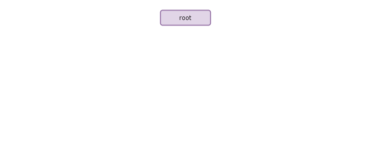

<script defer src="https://viewer.shapediver.com/v3/1.0.5/bundle.js"></script>
<style>
details[open] {
  margin-left: 10px;
  border-left: 5px solid #a0a0a0;
  padding-left: 10px;
}
</style>


# ShapeDiver-Viewer

To be up-to-date with all current changes, visit our [Release Notes](./releaseNotes.html).

If you want to update from an older version, please use our [Migration Guide](./migrationGuide.html).

_Note: In this document, the npm-module that is provided is always referenced as `ShapeDiver-Viewer`, which should not be confused with the [Viewer](./classes/api_api_src.viewer.html)s that can be created by it._
<br>

## Installation

You can install the ShapeDiver-Viewer with [npm](https://www.npmjs.com/). To install the module, open a terminal window in you project and run:
```bash
npm install --save @shapediver/viewer
```
The package will be downloaded and installed for you. In most cases, you'll need a bundling tool like [webpack](https://webpack.js.org/) to combine all the packages.


If you are having issues with the setup or ar just not that familiar with setting up projects, you can find a detailed example on how to setup a project from the start here: 
<details>

### NPM installations

First of all, you need to have a version of `npm` installed. We currently use version `7.7.6`, but any newer version should be fine.

Then, let's call some `npm` tasks and install some dependencies. Go to an empty folder that you want to use and call these commands. Some might not be necessary for you if you are integrating the viewer into an existing setup.

This command just initializes `npm` for this project and creates the `package.json` file that is needed.
```bash
npm init --yes
```

Then we install some development dependencies. The first one is `typescript`, as we are using TypeScript in this example, we also have to install the dependency for it.
The next three are all dependencies for webpack, we get to that later on.
```bash
npm install --save-dev typescript webpack webpack-cli ts-loader
```

Then, we install the actual ShapeDiver-Viewer dependency.
```bash
npm install --save @shapediver/viewer
```

### Adjusting Config Files

First, we create a file called `tsconfig.json` in the root of the project and add this content to it.
```json
{
    "compilerOptions": {
        "outDir": "./dist/",
        "module": "es6",
        "target": "es2015",
        "moduleResolution": "node"
    }
}
```

Then, we create a `webpack.config.js` file in the root of the directory and again, add some content to it. Here the package `ts-loader` is used, as webpack normally doesn't work with TypeScript files.
```javascript
const path = require('path');

module.exports = {
  entry: './src/index.ts',
  mode: 'production',
  module: {
    rules: [
      {
        test: /\.tsx?$/,
        use: 'ts-loader',
        exclude: /node_modules/,
      },
    ],
  },
  resolve: {
    extensions: ['.tsx', '.ts', '.js'],
  },
  output: {
    filename: 'bundle.js',
    path: path.resolve(__dirname, 'dist'),
  },
};
```
### Build

To build the project, in our `package.json` we just need to add a small script for that. Currently there is only a `test` script in there, we now add a `build` script to make it look like this:
```json
"scripts": {
  "build": "webpack",
  "test": "echo \"Error: no test specified\" && exit 1"
}
```

In the next chapter we will see a small example that we then can just call with the command  `npm run build` and see that a `dist` folder was created automatically.

To try this out, just create a simple [http-server](https://www.npmjs.com/package/http-server) in this folder and load the `index.html`.

</details>

<br>

## Simple Example
Let's now create our first example. For that we first need an HTML-Page on which we want to load our example. Therefore, we create an `index.html` file in the root of our project:
```html
<!DOCTYPE html>
<html>
<body>
    <div style="width: 100%; height: 100%;">
        <canvas id="canvas"></canvas>
    </div>
    <script type="module" src="./bundle.js"></script>
</body>

</html>
```
This HTML-File only has a canvas in it and a script tag that will load our script once it is built.

Now we create a `scr`-folder and add an `index.ts` file in it with the following contents:
```typescript
import "reflect-metadata"
import { api } from "@shapediver/viewer"

const modelViewUrl = 'https://sddev2.eu-central-1.shapediver.com'; // PLEASE ADD YOUR MODEL VIEW URL HERE
const ticket = 'f458732383d032fe0a479dea5e134da634c557e8d50f69621ce3f7fbd34f84c65a8b607585489f5877443f8292841a6e952c08990690cf127d169d202b098f66ee5368af94d02270f3d6d769de8e416608f80d0994b3d898a41be5f4f38a0c428699d1d7f9d9c4-6e86fe6d52d13f8f55b7b873bd75a0e6'; // PLEASE ADD YOUR TICKET HERE

(async () => {
  // create a viewer
  const viewer = await api.createAndInitializeViewer({ canvas: <HTMLCanvasElement>document.getElementById('canvas'), id: 'myViewer' });
  // create a session
  const session = await api.createAndInitializeSession({ ticket, modelViewUrl, id: 'mySession'});
})();
```
This is already everything we need. We import `reflect-metadata` as this is needed for some functionalities that we use. It should always be on top of the imports. Then we import the [api](./classes/api_api_src.api.html) from the ShapeDiver-Viewer.

Next we load a [Viewer](./classes/api_api_src.viewer.html) by providing a canvas (we created one in the `index.html`) and then we load a [Session](./classes/api_api_src.session.html). With the specified `ticket` and `modelViewUrl` you get the result as in the ShapeDiver-Viewer below. Please try it with your own `ticket` and `modelViewUrl` and don't forget to add the domain you are using to your allowed domains.

<div style="width: 100%; height: 500px;">
  <canvas id="canvas1"></canvas>
</div>
<script type='module'>
  const modelViewUrl = 'https://sddev2.eu-central-1.shapediver.com'; // PLEASE ADD YOUR MODEL VIEW URL HERE
  const ticket = 'f458732383d032fe0a479dea5e134da634c557e8d50f69621ce3f7fbd34f84c65a8b607585489f5877443f8292841a6e952c08990690cf127d169d202b098f66ee5368af94d02270f3d6d769de8e416608f80d0994b3d898a41be5f4f38a0c428699d1d7f9d9c4-6e86fe6d52d13f8f55b7b873bd75a0e6'; // PLEASE ADD YOUR TICKET HERE
  (async () => {      
    const viewer = await window.api.createAndInitializeViewer({ canvas: document.getElementById('canvas1'), id: 'myViewer1' });
    const session = await window.api.createAndInitializeSession({ ticket, modelViewUrl, id: 'mySession1', excludeViewers: ['myViewer2', 'myViewer3', 'myViewer4', 'myViewer5', 'myViewer6']});
  })();
</script>
<br>

## Sessions

In our simple example we already created a [Session](./classes/api_api_src.session.html) and a [Viewer](./classes/api_api_src.viewer.html). There can be many [Sessions](./classes/api_api_src.session.html) at once, but in most cases, there will only be one. With a [Session](./classes/api_api_src.session.html) you can do many things, you can change [Parameters](./classes/api_api_src.parameter.html), request [Exports](./classes/api_api_src.export.html) and customize your session with all the possibilities that you have set in Grasshopper.

A [Session](./classes/api_api_src.session.html) can exist completely without a [Viewer](./classes/api_api_src.viewer.html), as a [Viewer](./classes/api_api_src.viewer.html) can exist without a [Session](./classes/api_api_src.session.html). For more functions and properties, please see our Documentation on [Session](./classes/api_api_src.session.html), [Parameter](./classes/api_api_src.parameter.html), [Export](./classes/api_api_src.export.html) and [Output](./classes/api_api_src.output.html).
### Parameters

Let's continue with the simple example of our last section and add something to it. The [Session](./classes/api_api_src.session.html) that we use as an example can change the length of the provided shelf from values `2` to `10`. In our first case we just want to change it to `6`. 

After creating the [Viewer](./classes/api_api_src.viewer.html) and the [Session](./classes/api_api_src.session.html), we just call 

```typescript
// read out the parameter with the specific name
const lengthParameter = session.getParameterByName('Length')[0];
// update the value
lengthParameter.updateValue(6);
// and customize the scene
await session.customize();
```

<div style="width: 100%; height: 500px;">
  <canvas id="canvas2"></canvas>
</div>
<script type='module'>
  const modelViewUrl = 'https://sddev2.eu-central-1.shapediver.com'; // PLEASE ADD YOUR MODEL VIEW URL HERE
  const ticket = 'f458732383d032fe0a479dea5e134da634c557e8d50f69621ce3f7fbd34f84c65a8b607585489f5877443f8292841a6e952c08990690cf127d169d202b098f66ee5368af94d02270f3d6d769de8e416608f80d0994b3d898a41be5f4f38a0c428699d1d7f9d9c4-6e86fe6d52d13f8f55b7b873bd75a0e6'; // PLEASE ADD YOUR TICKET HERE
  (async () => {      
    const viewer = await window.api.createAndInitializeViewer({ canvas: document.getElementById('canvas2'), id: 'myViewer2' });
    const session = await window.api.createAndInitializeSession({ ticket, modelViewUrl, id: 'mySession2', excludeViewers: ['myViewer1', 'myViewer3', 'myViewer4', 'myViewer5', 'myViewer6']});
    const lengthParameter = session.getParameterByName('Length')[0];
    lengthParameter.updateValue(6);
    await session.customize();
  })();
</script>

You can also update multiple [Parameters](./classes/api_api_src.parameter.html) together and then customize the [Session](./classes/api_api_src.session.html) in the end. We will not update the length to `8` and update the color to `#00ff00` (green). Notice that the customization call is only called once. Therefore, only one request is sent to our servers.

```typescript
// read out the parameter with the specific name
const lengthParameter = session.getParameterByName('Length')[0];
// update the value
lengthParameter.updateValue(8);
// read out the parameter with the specific name
const colorParameter = session.getParameterByName('Material Color')[0];
// update the value
colorParameter.updateValue('#00ff00');
// and customize the scene
await session.customize();
```

<div style="width: 100%; height: 500px;">
  <canvas id="canvas3"></canvas>
</div>
<script type='module'>
  const modelViewUrl = 'https://sddev2.eu-central-1.shapediver.com'; // PLEASE ADD YOUR MODEL VIEW URL HERE
  const ticket = 'f458732383d032fe0a479dea5e134da634c557e8d50f69621ce3f7fbd34f84c65a8b607585489f5877443f8292841a6e952c08990690cf127d169d202b098f66ee5368af94d02270f3d6d769de8e416608f80d0994b3d898a41be5f4f38a0c428699d1d7f9d9c4-6e86fe6d52d13f8f55b7b873bd75a0e6'; // PLEASE ADD YOUR TICKET HERE
  (async () => {      
    const viewer = await window.api.createAndInitializeViewer({ canvas: document.getElementById('canvas3'), id: 'myViewer3' });
    const session = await window.api.createAndInitializeSession({ ticket, modelViewUrl, id: 'mySession3', excludeViewers: ['myViewer1', 'myViewer2', 'myViewer4', 'myViewer5', 'myViewer6']});
    const lengthParameter = session.getParameterByName('Length')[0];
    lengthParameter.updateValue(8);
    const colorParameter = session.getParameterByName('Material Color')[0];
    colorParameter.updateValue('#00ff00');
    await session.customize();
  })();
</script>

### Exports

[Exports](./classes/api_api_src.export.html) can be requested easily as well. In our example, there is no [Export](./classes/api_api_src.export.html) available, but it is straight-forward.

```typescript
// read out the export with the specific name
const export = session.getExportByName('the name of the export')[0];
// request the export
const exportResult = await export.request();
```

## Viewers

A [Viewer](./classes/api_api_src.viewer.html) can exist completely without a [Session](./classes/api_api_src.session.html), as a [Session](./classes/api_api_src.session.html) can exist without a [Viewer](./classes/api_api_src.viewer.html). The [Viewer](./classes/api_api_src.viewer.html) is responsible for rendering and rendering related settings. For example, camera and light management happens here. Additionally, a [Viewer](./classes/api_api_src.viewer.html) has many options, as rendering options can be enabled or disable (shadows, ambient occlusion, etc.) and scene properties can be adjusted (groundplane, grid, etc.).

By reusing the simple example from the first section, we will now disable the groundplane. The logic presented can be used for many of the standard properties.

```typescript
// just call the update function for the groundplane value
viewer.updateGroundPlaneVisibility(false);
// get the value for the groundplane visibility (read-only)
const groundPlaneVisibility = viewer.groundPlaneVisibility;
```
<div style="width: 100%; height: 500px;">
  <canvas id="canvas4"></canvas>
</div>
<script type='module'>
  const modelViewUrl = 'https://sddev2.eu-central-1.shapediver.com'; // PLEASE ADD YOUR MODEL VIEW URL HERE
  const ticket = 'f458732383d032fe0a479dea5e134da634c557e8d50f69621ce3f7fbd34f84c65a8b607585489f5877443f8292841a6e952c08990690cf127d169d202b098f66ee5368af94d02270f3d6d769de8e416608f80d0994b3d898a41be5f4f38a0c428699d1d7f9d9c4-6e86fe6d52d13f8f55b7b873bd75a0e6'; // PLEASE ADD YOUR TICKET HERE
  (async () => {      
    const viewer = await window.api.createAndInitializeViewer({ canvas: document.getElementById('canvas4'), id: 'myViewer4' });
    const session = await window.api.createAndInitializeSession({ ticket, modelViewUrl, id: 'mySession4', excludeViewers: ['myViewer1', 'myViewer2', 'myViewer3', 'myViewer5', 'myViewer6']});
    viewer.updateGroundPlaneVisibility(false);
  })();
</script>

### Cameras

One of the standard adaptions is to change some [Camera](./classes/api_api_src.camera.html) properties. We distinguish here between a [Perspective Camera](./classes/api_api_src.perspectivecamera.html) and an [Orthographic Camera](./classes/api_api_src.orthographiccamera.html).

In our next example we create an [Orthographic Camera](./classes/api_api_src.orthographiccamera.html), which will be assigned as the default camera automatically. 
```typescript
// create an orthographic camera, it will be assigned automatically
const camera = viewer.createOrthographicCamera();
// we now update the direction of the orthographic camera
camera.updateDirection(ORTHOGRAPHIC_CAMERA_DIRECTION.FRONT);
```
<div style="width: 100%; height: 500px;">
  <canvas id="canvas5"></canvas>
</div>
<script type='module'>
  const modelViewUrl = 'https://sddev2.eu-central-1.shapediver.com'; // PLEASE ADD YOUR MODEL VIEW URL HERE
  const ticket = 'f458732383d032fe0a479dea5e134da634c557e8d50f69621ce3f7fbd34f84c65a8b607585489f5877443f8292841a6e952c08990690cf127d169d202b098f66ee5368af94d02270f3d6d769de8e416608f80d0994b3d898a41be5f4f38a0c428699d1d7f9d9c4-6e86fe6d52d13f8f55b7b873bd75a0e6'; // PLEASE ADD YOUR TICKET HERE
  (async () => {      
    const viewer = await window.api.createAndInitializeViewer({ canvas: document.getElementById('canvas5'), id: 'myViewer5' });
    const session = await window.api.createAndInitializeSession({ ticket, modelViewUrl, id: 'mySession5', excludeViewers: ['myViewer1', 'myViewer2', 'myViewer3', 'myViewer4', 'myViewer6']});
    const camera = viewer.createOrthographicCamera();
    camera.updateDirection(ORTHOGRAPHIC_CAMERA_DIRECTION.FRONT);
  })();
</script>

### Lights

For lights, we always handle a bunch of them at once, that's why we introduce [Light Scenes](). A [Light Scene]() is a grouping of lights. The lights in a [Light Scene]() can be freely manipulated.

Therefore, we now create a new [Light Scene]() and add a few lights to it.

```typescript
// create a light scene, it will be assigned automatically
const lightScene = viewer.createLightScene();
// add a new ambient light, it will be added to the current light scene
const ambientLight = viewer.addAmbientLight();
// add a new directional light, it will be added to the current light scene
const directionalLight = viewer.addDirectionalLight();
// change the color of the directional light
directionalLight.updateColor('#0000ff');
```
<div style="width: 100%; height: 500px;">
  <canvas id="canvas6"></canvas>
</div>
<script type='module'>
  const modelViewUrl = 'https://sddev2.eu-central-1.shapediver.com'; // PLEASE ADD YOUR MODEL VIEW URL HERE
  const ticket = 'f458732383d032fe0a479dea5e134da634c557e8d50f69621ce3f7fbd34f84c65a8b607585489f5877443f8292841a6e952c08990690cf127d169d202b098f66ee5368af94d02270f3d6d769de8e416608f80d0994b3d898a41be5f4f38a0c428699d1d7f9d9c4-6e86fe6d52d13f8f55b7b873bd75a0e6'; // PLEASE ADD YOUR TICKET HERE
  (async () => {      
    const viewer = await window.api.createAndInitializeViewer({ canvas: document.getElementById('canvas6'), id: 'myViewer6' });
    const session = await window.api.createAndInitializeSession({ ticket, modelViewUrl, id: 'mySession6', excludeViewers: ['myViewer1', 'myViewer2', 'myViewer3', 'myViewer4', 'myViewer5']});
    const lightScene = viewer.createLightScene();
    const ambientLight = viewer.addAmbientLight();
    const directionalLight = viewer.addDirectionalLight();
    directionalLight.updateColor('#0000ff');
  })();
</script>

## The Scene tree

This application has it's own scene tree in which sessions store their computed outputs, but you can also create, adjust and remove parts of the scene tree yourself.

The scene tree is a tree structure with a single root node. Every node can have any number of children and data items. The data items contain the actual information, whereas the nodes are only used to maintain and manage the hierarchy.

Data items can simply be changed and adjusted. Only the version of the data item has to be updated to notify the renderer that a change has happened.

### Basic Setup

Before we do anything, the scene tree has already been created. There is nothing in it besides the root node.



So let's just look at how the scene tree looks after we create a single session. Our scene tree now change as a node was added automatically. Let's assume, the session has two outputs with one content each. Then the scene tree will look like this:


### Copying Nodes
If we would customize the scene again, every output that is loaded again would be overwritten.
Therefore, we now save our session node by copying it.

```typescript

// We first need the scene tree
const sceneTree = api.sceneTree;

// Then we just get to the right node and copy it
const clonedNode = sceneTree.root.children[0].clone()
```

### Adjusting the Scene tree
Let's now customize the scene again and then add our copied node with some translation.

```typescript
// Get a parameter with a specific ID
const parameter = session.getParameterById('SOME_ID');

// To change the value of this parameter we can simply just change it (setter method takes care of checking if the value is approved)
parameter.updateValue('newValue')

// Customize the session
await session.customize();

// Add the node to the scene
sceneTree.addChild(clonedNode);
```

The result is now that we have the geometry two times, once in the old configuration and once in the new configuration.


<!--- VERSION_START -->
## Version
* __Version:__ 1.0.5
* __Build date:__ 2021-08-30T15:41:30.479Z
* __Branch:__ development
* __Commit:__ 4144530568339000eff9f3646139772daec64150
<!--- VERSION_END -->